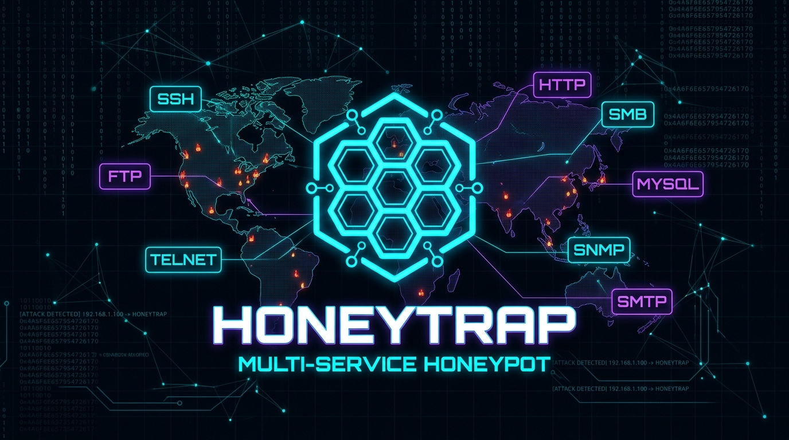



# 🍯 HoneyTrap — Multi-Service Honeypot

**A production-grade cybersecurity honeypot that lures, captures, and visualizes real-world attack behavior in real time.**

[**Demo Video**](#-demo-video) · [**Quick Start**](#-quick-start) · [**Architecture**](#-architecture)

---

## 📽 Demo Video

https://github.com/CyberVortexX/multi-service-honeypot/releases/download/v1.0.0/honey-trap-demo.mp4

> Watch HoneyTrap intercept SSH brute-force, FTP credential stuffing, Telnet IoT botnet attacks, and HTTP exploit scans — all visualized live on the world map dashboard.

---

## ✨ What Is HoneyTrap?

HoneyTrap is a **multi-protocol honeypot** that simultaneously emulates **SSH, FTP, Telnet, and HTTP** servers on decoy ports. Every connection attempt is:

1. **Captured** — credentials, payloads, user-agents, and headers logged
2. **Geolocated** — attacker IP resolved to city, country, and ISP via ip-api.com
3. **Tagged** — classified with MITRE ATT&CK tactic, technique, and severity
4. **Streamed** — pushed instantly to a live web dashboard via WebSocket
5. **Persisted** — stored to a JSONL log file for offline analysis

---

## 🚀 Features

| Feature | Description |
|---|---|
| 🔐 **SSH Honeypot** | Full Paramiko SSH handshake — captures brute-force credentials on port **2222** |
| 📂 **FTP Honeypot** | RFC-compliant FTP banner — captures credential stuffing on port **2121** |
| 💻 **Telnet Honeypot** | Ubuntu 22.04 login banner — catches IoT Mirai botnet sweeps on port **2323** |
| 🌐 **HTTP Honeypot** | Apache/PHP fingerprint — logs web crawlers and exploit paths on port **8080** |
| 🗺 **Live Attack Map** | Leaflet.js world map with animated markers per attacker geolocation |
| ⚡ **Real-time Feed** | Instant WebSocket push via Flask-SocketIO — zero polling |
| 📊 **KPI Dashboard** | Live counters per service with sparkline trend charts |
| 📋 **Filterable Log Table** | Searchable event table — filter by SSH / FTP / Telnet / HTTP |
| 🎯 **MITRE ATT&CK Tags** | Every event tagged with tactic, technique (e.g. T1110.001), and severity |
| 🎭 **5-Campaign Simulator** | Realistic attack simulator (Mirai Botnet, APT, Script-Kiddie, and more) |
| ⬇ **JSON Export** | One-click download of all captured events |
| 🔄 **Persistent Logs** | Events survive server restarts — reloaded from JSONL on startup |
| 🌍 **IP Geolocation** | City, country, ISP, and GPS coordinates for map plotting |
| 🖥 **Windows One-Click Launch** | start.bat auto-installs deps, starts server, opens browser |

---

## 📸 Dashboard Preview

`
┌─────────────────────────────────────────────────────────────────┐
│  🍯 HoneyTrap          ● LIVE MONITORING    [🗑 Clear] [⬇ Export]│
├──────────┬──────────┬──────────┬──────────┬────────────────────┤
│  🎯 847  │  🔐 312  │  📂 198  │  💻 224  │  🌐 113            │
│  Total   │   SSH    │   FTP    │  Telnet  │  HTTP              │
├──────────┴──────────┴──────────┴──────────┴────────────────────┤
│  🗺 Global Attack Map (Leaflet)    │  ⚡ Live Feed              │
│  [World map with attack markers]   │  [SSH] 185.220.x.x Russia  │
│  Red/orange dots per attacker IP   │  [FTP] 218.92.x.x China    │
│  with popup: IP, city, ISP         │  [Tel] 91.108.x.x Ukraine  │
├────────────────────────────────────┴────────────────────────────┤
│  📋 Attack Log — [All][SSH][FTP][Telnet][HTTP]                  │
│  # │ Time    │ Service │ IP         │ Location │ User  │ Pass   │
│  1 │ 12:34:01│ SSH HIGH│ 185.220... │ Germany  │ root  │ 123456 │
└─────────────────────────────────────────────────────────────────┘
`

---

## ⚡ Quick Start

### Prerequisites
- **Python 3.12+** installed and on PATH
- Internet connection (for IP geolocation lookups)

### Option A — Windows (One-Click)

`at
REM Just double-click start.bat
REM It will: kill old instances → install deps → start server → open browser
start.bat
`

### Option B — Manual (All Platforms)

`ash
# 1. Install dependencies
pip install flask flask-socketio paramiko requests eventlet

# 2. Start the honeypot (all 4 services + dashboard)
python honeypot_server.py

# 3. Open dashboard in browser
# http://localhost:5000

# 4. (Optional) Run attack simulation
python simulate_attacks.py
`

---

## 🔌 Port Map

| Service | Honeypot Port | Emulates Real Port |
|---|:---:|:---:|
| 🔐 SSH | **2222** | 22 |
| 📂 FTP | **2121** | 21 |
| 💻 Telnet | **2323** | 23 |
| 🌐 HTTP | **8080** | 80 |
| 📊 Dashboard | **5000** | — |

> **Note:** Alternate ports are used for safe testing without root/admin privileges. To capture attacks on real ports (22, 21, 23, 80), run with elevated privileges and change the port constants in honeypot_server.py.

---

## 🏗 Architecture

`
┌─────────────────────────────────────────────────────────────────────┐
│                        HoneyTrap System                             │
│                                                                     │
│  ┌──────────────┐  ┌──────────────┐  ┌──────────────┐  ┌────────┐  │
│  │ SSH Honeypot │  │ FTP Honeypot │  │ Telnet HP    │  │ HTTP HP│  │
│  │  Port 2222   │  │  Port 2121   │  │  Port 2323   │  │ Pt8080 │  │
│  │  (Paramiko)  │  │  (raw sock)  │  │  (raw sock)  │  │(socket)│  │
│  └──────┬───────┘  └──────┬───────┘  └──────┬───────┘  └───┬────┘  │
│         └─────────────────┴──────────────────┴──────────────┘       │
│                                    │                                 │
│                            log_event()                               │
│                                    │                                 │
│                    ┌───────────────▼──────────────┐                 │
│                    │        Event Pipeline         │                 │
│                    │  1. Geo lookup (ip-api.com)   │                 │
│                    │  2. MITRE ATT&CK tagging      │                 │
│                    │  3. Append to attacks.json    │                 │
│                    │  4. socketio.emit() to clients│                 │
│                    └───────────────┬──────────────┘                 │
│                                    │                                 │
│                    ┌───────────────▼──────────────┐                 │
│                    │    Flask Dashboard :5000      │                 │
│                    │  GET /           → index.html │                 │
│                    │  GET /api/events → JSON log   │                 │
│                    │  GET /api/stats  → KPI data   │                 │
│                    │  POST /api/inject → simulator │                 │
│                    │  POST /api/clear → reset      │                 │
│                    └───────────────┬──────────────┘                 │
│                                    │ WebSocket (Socket.IO)           │
│                    ┌───────────────▼──────────────┐                 │
│                    │     Browser Dashboard         │                 │
│                    │  Leaflet Map + Live Feed +    │                 │
│                    │  KPI Cards + Log Table        │                 │
│                    └──────────────────────────────┘                 │
└─────────────────────────────────────────────────────────────────────┘
`

---

## 🎭 Attack Simulator (5 Campaigns)

Run python simulate_attacks.py to generate realistic attack traffic:

| Campaign | Services | Tactic | Severity |
|---|---|---|---|
| 🤖 **Mirai Botnet Sweep** | Telnet + SSH | Initial Access | HIGH |
| 📦 **Credential Stuffing** | FTP + SSH | Credential Access | HIGH |
| 🔍 **Web Vulnerability Scan** | HTTP | Discovery | MEDIUM |
| 🎩 **APT Reconnaissance** | All services | Reconnaissance | CRITICAL |
| 💥 **Script-Kiddie Blast** | All services | Execution | LOW |

Each campaign uses realistic IP pools from **12 countries** with proper protocol handshakes.

---

## 📝 Sample Log Entry

`json
{
  "id": 42,
  "timestamp": "2026-10-09T05:14:23.456Z",
  "service": "SSH",
  "ip": "185.220.101.45",
  "port": 54312,
  "username": "root",
  "password": "password123",
  "geo": {
    "city": "Frankfurt",
    "country": "Germany",
    "lat": 50.1109,
    "lon": 8.6821,
    "org": "AS13335 Cloudflare, Inc."
  },
  "tactic": "Credential Access",
  "technique": "T1110.001 - Password Guessing",
  "severity": "HIGH",
  "campaign": "Mirai Botnet Sweep"
}
`

---

## 🗂 Project Structure

`
honeypot/
├── honeypot_server.py        # Core server — all honeypot services + dashboard API
├── simulate_attacks.py       # 5-campaign MITRE ATT&CK attack simulator
├── start.bat                 # Windows one-click launcher
├── banner.jpg                # Project banner
├── templates/
│   └── index.html            # Dashboard SPA (Leaflet map + Socket.IO + tables)
├── static/
│   ├── css/
│   │   ├── style.css         # Dark cyber theme (glassmorphism + neon effects)
│   │   └── leaflet.css       # Leaflet map styles
│   └── js/
│       ├── dashboard.js      # Real-time frontend logic (WebSocket + map + KPIs)
│       ├── leaflet.js        # Interactive world map library
│       └── socket.io.min.js  # WebSocket client
├── logs/
│   ├── attacks.json          # Persistent JSONL event log (gitignored)
│   └── host_rsa.key          # Auto-generated SSH host key (gitignored)
└── README.md
`

---

## 🛠 Tech Stack

| Layer | Technology |
|---|---|
| **Core Runtime** | Python 3.12+ |
| **SSH Emulation** | Paramiko (full SSH handshake) |
| **Web Framework** | Flask 3.x |
| **Real-time Push** | Flask-SocketIO + Socket.IO |
| **Map Rendering** | Leaflet.js (offline-capable) |
| **IP Geolocation** | ip-api.com (free, 45 req/min) |
| **Frontend Fonts** | Google Fonts — Outfit + JetBrains Mono |
| **Event Persistence** | JSONL flat-file database |

---

## ⚠️ Ethical & Legal Notice

> **This project is for educational and research purposes only.**

- ✅ Deploy only on **networks and systems you own** or have explicit written permission to monitor
- ✅ Use in **isolated lab environments** or **CTF / academic research**
- ❌ Do **not** deploy on public networks to intercept traffic without authorization
- ❌ Do **not** use captured credentials for any unauthorized access
- ❌ Do **not** violate any computer crime laws (CFAA, Computer Misuse Act, etc.)

Captured data may contain real credentials from scanning bots — handle responsibly.

---

## 📄 License

This project is licensed under the **MIT License** — see [LICENSE](LICENSE) for details.

---

**Built with ❤️ by [CyberVortexX](https://github.com/CyberVortexX)**

*If this project helped you learn about cybersecurity honeypots, please star the repo!*

